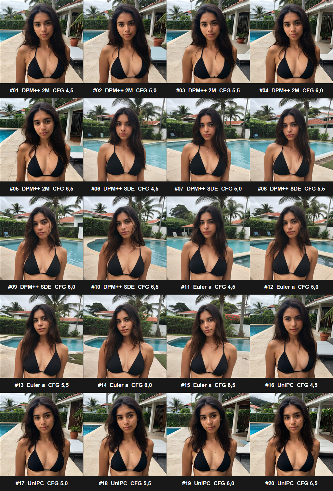

# SD.Next Photorealism Workflow

A reproducible, Windows-first workflow for generating non-explicit lifestyle and swimwear photography of a fictional, clearly adult character. It preserves the approved baseline, exact prompts, deterministic settings, comparison images, experiment metadata, and PowerShell automation used with Stability Matrix and SD.Next.



## Is it ready to run?

Yes. After the three external prerequisites below are installed, the workflow runs with one command:

```powershell
.\scripts\Run-Workflow.ps1
```

The repository intentionally does **not** include the Stability Matrix application, the SD.Next package, or the approximately 2 GB CyberRealistic checkpoint. Model weights and credentials must never be committed to this repository.

Required external components:

1. Stability Matrix.
2. The SD.Next package installed through Stability Matrix.
3. CyberRealistic v9.0, SD 1.5, pruned FP16, with AutoV2 hash `22C7896047`.

## Approved baseline

| Setting | Value |
|---|---|
| Checkpoint | CyberRealistic v9.0, pruned FP16 |
| Model family | Stable Diffusion 1.5 |
| AutoV2 hash | `22C7896047` |
| Sampler | `DPM++ SDE` |
| Sigma schedule | `Karras` |
| CFG | `6.0` |
| Steps | `25` |
| Seed | `231984751` |
| Test resolution | `512 × 512` |
| VAE mode | `Full` |
| Batch size | `1` |
| Hires fix | Disabled |
| Detailer | Disabled |
| LoRA, ControlNet, IP-Adapter | None |
| Input image | None |

The approved image is stored at `samples/baseline-n9.png`. The full rationale is documented in `docs/BASELINE-N9-ANALYSIS.md`.

The reproduction script was validated in the original environment. The regenerated image had the same SHA-256 hash as the approved baseline and was therefore byte-for-byte identical. See `metadata/VERIFICATION.md`.

## Official resources

| Component | Resource |
|---|---|
| This workflow | [vinimaffra03/sdnext-realism-workflow](https://github.com/vinimaffra03/sdnext-realism-workflow) |
| Stability Matrix downloads | [Official Lykos AI downloads](https://lykos.ai/downloads) |
| Stability Matrix source | [LykosAI/StabilityMatrix](https://github.com/LykosAI/StabilityMatrix) |
| Stability Matrix installation guide | [Official installation documentation](https://github.com/LykosAI/StabilityMatrix/blob/main/docs/getting-started/installation.md) |
| SD.Next source | [vladmandic/sdnext](https://github.com/vladmandic/sdnext) |
| SD.Next documentation | [Official SD.Next documentation](https://vladmandic.github.io/sdnext/) |
| SD.Next API documentation | [Official API guide](https://github.com/vladmandic/sdnext/wiki/API) |
| CyberRealistic v9.0 page | [Official CivitAI distribution page](https://civitai.com/models/15003/cyberrealistic?modelVersionId=1941849) |
| Exact pruned FP16 checkpoint | [CivitAI model version 1941849, file 1839464](https://civitai.com/api/download/models/1941849?fileId=1839464) |

CyberRealistic is distributed through CivitAI; it does not have an official source-code repository required by this workflow. Review the model page for its current license and usage terms before using or redistributing outputs.

## Start from zero on Windows

### 1. Clone this private workflow repository

You need access to the private repository and an authenticated Git client:

```powershell
git clone https://github.com/vinimaffra03/sdnext-realism-workflow.git
cd sdnext-realism-workflow
```

### 2. Install Stability Matrix

1. Download the Windows x64 release from the [official downloads page](https://lykos.ai/downloads) or [GitHub Releases](https://github.com/LykosAI/StabilityMatrix/releases).
2. Extract the archive to a writable location with sufficient free disk space.
3. Run `StabilityMatrix.exe`.
4. Complete the first-launch setup and choose a data directory. Portable mode is supported.

Stability Matrix manages packages, shared model folders, Python environments, and launch settings. This workflow was developed and tested with SD.Next managed by Stability Matrix.

### 3. Install the SD.Next package

Inside Stability Matrix:

1. Open **Packages**.
2. Select **Add Package**.
3. Select **SD.Next**.
4. Install the current stable/default branch.
5. Wait until dependency installation completes.

Do not separately clone SD.Next when using this path; Stability Matrix installs and manages the [official SD.Next repository](https://github.com/vladmandic/sdnext) for you.

### 4. Install the exact CyberRealistic checkpoint

Recommended method:

1. Open the model browser or checkpoint manager in Stability Matrix.
2. Search for **CyberRealistic** by Cyberdelia.
3. Select model ID `15003`, version **v9.0** / version ID `1941849`.
4. Select the **pruned FP16** SafeTensor file, file ID `1839464`.
5. Import it into the shared Stable Diffusion checkpoint folder.

Manual method:

1. Download the [exact pruned FP16 file](https://civitai.com/api/download/models/1941849?fileId=1839464).
2. Place it in:

   ```text
   <Stability Matrix data directory>\Models\StableDiffusion\
   ```

3. Refresh model discovery or restart SD.Next.

The original CivitAI filename may be `cyberrealistic_v90.safetensors`. Renaming it is optional because the scripts locate the checkpoint by cryptographic hash, not filename.

Verify the file before use:

```powershell
Get-FileHash -Algorithm SHA256 -LiteralPath '<path-to-checkpoint>'
```

Expected values:

```text
AutoV2: 22C7896047
SHA-256: 22C789604729ED346F745497B99EB62DF116E7B50F671E4EDF4058D382B0A235
```

Do not accidentally select the larger FP32 file. It has a different hash and is not the checkpoint used for this baseline.

### 5. Launch SD.Next

1. In Stability Matrix, open **Packages**.
2. Find **SD.Next** and select **Launch**.
3. Wait for the WebUI to open and for `http://127.0.0.1:7860` to respond.
4. Leave SD.Next running while the scripts execute.

The scripts use SD.Next's public `POST /sdapi/v1/txt2img` endpoint. Interactive API documentation is normally available at `http://127.0.0.1:7860/docs` while SD.Next is running.

For an NVIDIA GPU with approximately 4 GB of VRAM, keep the baseline at 512 × 512, batch size 1, and use SD.Next's low-memory/medium-memory launch options when required. The original environment used CUDA with medium-VRAM optimization.

### 6. Allow scripts for the current PowerShell process if required

If Windows blocks local scripts:

```powershell
Set-ExecutionPolicy -Scope Process -ExecutionPolicy Bypass
```

This changes policy only for the current PowerShell process.

### 7. Run the complete baseline workflow

```powershell
.\scripts\Run-Workflow.ps1
```

This command:

1. Confirms that the SD.Next API is reachable.
2. Finds the exact checkpoint by SHA-256 or AutoV2 hash.
3. Sends the versioned baseline payload.
4. Saves the PNG and a JSON metadata sidecar under `runs/`.

To use a non-default SD.Next address:

```powershell
.\scripts\Run-Workflow.ps1 -ApiBaseUri 'http://127.0.0.1:7861'
```

## Individual commands

Test the API and checkpoint:

```powershell
.\scripts\Test-SDNextConnection.ps1
```

Generate one deterministic baseline image:

```powershell
.\scripts\Invoke-SDNextBaseline.ps1
```

Repeat the original 20-image sampler/CFG matrix:

```powershell
.\scripts\Test-SDNextMatrix.ps1
```

Generate the 20-seed Camila identity experiment:

```powershell
.\scripts\Invoke-CamilaSet.ps1
```

That experiment changes the identity description while preserving the approved realism blocks and negative prompt. It writes the images, `manifest.csv`, `contact-sheet.png`, and `head-to-head.png` to `runs/camila-claude-v1/`. See `docs/CLAUDE-VS-GPT-COMPARISON.md`.

Run the controlled 10-scene by 5-stage identity stress test:

```powershell
# Validate one scene across all five stages first.
.\scripts\Invoke-IdentityStressTest.ps1 -StartShot 1 -EndShot 1

# Resume or run the complete 50-image matrix.
.\scripts\Invoke-IdentityStressTest.ps1
```

The five stages compare text-only generation, IP-Adapter Plus Face, FaceID, an OpenPose-only composition, and a two-stage finish that applies the Detailer, 2x upscale, and offline FaceSwap in that order. Identity is deliberately applied after pose generation because IP-Adapter and OpenPose competed for composition on the tested 4 GB GPU. Read [`docs/IDENTITY-STRESS-TEST.md`](docs/IDENTITY-STRESS-TEST.md) before running it.

The resumable background launcher now accepts an explicit configuration and stage list:

```powershell
.\scripts\Start-IdentityProductionBatch.ps1 `
  -OutputDirectory '.\runs\identity-production-v3-safe-frame' `
  -ConfigPath '.\config\identity-production-v3-safe-frame.json' `
  -Stages POS,FIN
```

`identity-production-v3-safe-frame.json` is the corrective seven-shot configuration produced after the V2 review. Its prepared OpenPose maps are centered with safe margins by `scripts/Prepare-OpenPoseSafeFrame.py`; the executor can consume those maps directly without requiring matching TXT images. `scripts/Measure-FaceIdentity.py` records InsightFace cosine similarity against the authorized fictional reference.

Run the V4 Brazilian-environment pilot for the original N9 brunette:

```powershell
.\scripts\Start-IdentityProductionV4.ps1 -Mode Pilot
```

V4 compares text-only, IP-Adapter Plus Face and FaceID, then supports a resumable ceiling of ten candidates for each of ten planned shots. It deliberately removes the mandatory InSwapper 128 final pass, supports optional localized face/eye/hand inpainting, and writes separate Lanczos and RealESRGAN 2x review outputs. See [`docs/IDENTITY-PRODUCTION-V4.md`](docs/IDENTITY-PRODUCTION-V4.md) for the candidate, selection and finalization commands.

On a memory-constrained Windows system, use the optional preflighted launcher before the pilot:

```powershell
.\scripts\Start-SDNextLowMemory.ps1 -ComputeDType BF16 -MemoryMode lowvram
```

It uses a separate no-autoload configuration and balanced model offload, and refuses to start when Windows has insufficient free committed-memory headroom. BF16 compute is required for this checkpoint on the tested GTX 1650 because FP16 produced invalid black images. It never closes applications or changes the page file automatically.

The tested SD.Next revision needs two small API compatibility fixes before the `POS` stage can use OpenPose. Stop SD.Next, apply the version-checked patch, and restart it:

```powershell
.\scripts\Apply-SDNextApiCompatibilityPatch.ps1 `
  -PackagePath '<Stability Matrix data directory>\Packages\SD.Next'

.\scripts\Start-SDNextLowMemory.ps1 -ComputeDType BF16 -MemoryMode lowvram
```

The patch corrects the `/sdapi/v1/preprocess` response schema and makes API-created ControlNet units inherit the active BF16 dtype. The low-memory launcher intentionally keeps the Control tab initialized because SD.Next registers selectable Control scripts while building that tab. It refuses an untested SD.Next revision unless `-AllowDifferentRevision` is supplied deliberately, creates backups before editing, validates Python syntax, and requires a restart. See [`docs/IDENTITY-STRESS-TEST.md`](docs/IDENTITY-STRESS-TEST.md) for the tested limitations.

## Repository structure

```text
config/     Exact baseline and experiment configurations
docs/       Pipeline, baseline analysis, and experiment rationale
metadata/   Original matrix results, verification record, and checksums
samples/    Approved baseline, comparison sheet, and original matrix images
scripts/    Connection checks and reproducible generation scripts
runs/       New local outputs; ignored by Git
```

## Troubleshooting

### SD.Next cannot be reached

- Confirm that SD.Next is still running in Stability Matrix.
- Open `http://127.0.0.1:7860` in a browser.
- If another port is used, pass `-ApiBaseUri` to the script.

### The checkpoint hash is not found

- Confirm that version v9.0, pruned FP16 was downloaded.
- Refresh model discovery or restart SD.Next.
- Compare the checkpoint SHA-256 with the expected value above.
- The filename is irrelevant; the file contents and hash must match.

### CUDA out-of-memory error

- Keep 512 × 512 resolution and batch size 1 for initial tests.
- Enable SD.Next memory optimization for low-VRAM hardware.
- Close other GPU-intensive applications.
- Do not enable Hires fix, Detailer, ControlNet, and upscale simultaneously.

### OpenPose fails with a response-schema or dtype error

- Confirm that SD.Next is at the tested revision documented in `docs/IDENTITY-STRESS-TEST.md`.
- Stop SD.Next and run `scripts/Apply-SDNextApiCompatibilityPatch.ps1` as shown above.
- Restart with BF16 compute and `-MemoryMode lowvram`.
- Validate one `POS` scene before starting the complete matrix.

### FaceSwap is silently ignored on the Control API

- Start SD.Next with `scripts/Start-SDNextLowMemory.ps1`; its default disabled-tab list keeps the Control tab initialized.
- Confirm that `GET /sdapi/v1/scripts` lists `face: multiple id transfers` under `control`.
- The production path does not run FaceSwap inside diffusion. It applies `scripts/Invoke-OfflineFaceSwap.py` after pose, detail, and upscale so identity cannot change composition.

### A script is blocked by Windows

Use the process-scoped execution-policy command shown in step 6, then run the workflow again.

## Experimental rule

Change only one variable per test. Keep the seed fixed while refining the same composition. Change the seed only when intentionally exploring a different pose or composition.

## Content and data requirements

- Keep every generated subject fictional and clearly adult.
- The approved baseline is non-explicit swimwear/lifestyle photography.
- Do not use a real person's likeness without documented permission.
- Keep source and authorization records for any future reference images, FaceID/IP-Adapter inputs, or LoRA training data.
